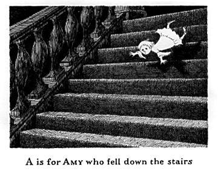
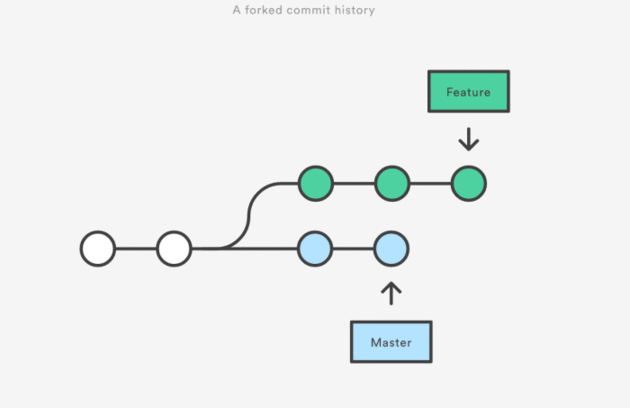
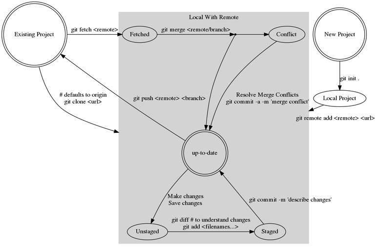
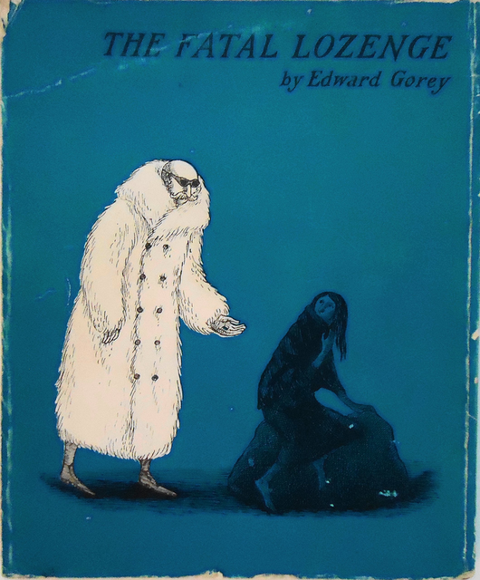

<!-- $theme: gaia -->

# Preamble
https://bit.ly/2IMdGdm

In order to participate, your environment should have:
1. `git` is installed on your computer
2. A text editor (such as `atom`) installed on your computer
3. A `github` account setup
4. You must know your password for `github` and your `email` 

Give your Github username to the TAs! Once you've been invited, we can get started.

_If you didn't bring a computer, or are unfamiliar with terminal commands, make a friend_

---
# BioData Club

#### Thanks to OHSU for hosting

#### Thanks to Philip, Ted, Lisa, Robin

   

---
# Intro to Git

https://bit.ly/2IMdGdm

This talk will not cover, or expect, specific programming languages
This talk will:

1. Introduce a collaborative demo using git and Github
2. Introduce vocabulary for using git and Github
3. Understand a simple git workflow
4. Talk about access control and Github

---
# Goals
If you successfully finish workshop, you will
- be able to collaborate on simple projects using git and Github
- understand basic vocabulary for git
- know what to study next and where to find resources

---
# Why should you Care?
- No more emailing document revisions
- Simpler local directory/file structures
- Remote storage
- Stable workflow
- Easily add new collaborators to project
- The world's most boring time machine

---
# Your Project!
After I assign you an **issue** of content,
- add text contents of **issue** to the `README.md` file
- belonging to an **existing repository**
- in **alphabetical order**.
- Finally, use git to share your changes



```text
A is for Amy who fell down the stairs
B is for Basil assaulted by bears
C is for Clara who wasted away
...
Z is for Zillah who drank to much gin
```

---
# What is Git?
- Source and version control
- Ledger of work
- Collaboration tool
- Workflow management software

competes with : **hg**, **svn**, **cvs**

---
# What is Github?
- Git service provider
- Account management and access control
- Hosting platform
- Ticket tracker / project management tool

competes with : **GitLab**, **bitbucket**, **coding.net**

---
## What to store in Github?
- source code (any language)
- markdown / Jupyter / pdf
- small public (images & data-sets)

## What NOT to store?
- PASSWORDS, access tokens, or private keys
- PHI, large images, large data-sets
- compiled binaries
- Non-pars-able documents (Word, Photoshop, ...)

---

# Vocabulary (I)

- **Working Copy** - version of files I can currently edit
- `diff`, `status`, `log` - What state am I in?
- `checkout` - swaps current working copy to specific `commit`

---

# Vocabulary (II)
- `remote` **labels that alias another location (host)**


---

# Vocabulary (III)
- `init` / `clone` - Starts a Project

- `add`/`commit` add to ledger history - Tracks Changes
- `fetch`/`merge` Join multiple ledgers and handle merge conflicts
- `push` - Share Changes

<!--
---
# Vocabulary (IV)
- `branch` - encapsulates a split in ledger of work
- `revert` - oh crap, I made a mistaek (backwards in time)


-->

---
## Merge Conflicts
```bash
$ git status
# On branch branch-b
...
# both modified:
```

```bash
$ cat styleguide.md
If you have questions, please
email a contributor.
```

```text
$ cat styleguide.md
If you have a question, please open an issue on
github. If you have a solution, please submit
a pull request.
```

---
# Workflow Map


---
# Message Flag and Editor

If you don't use the `-m` message flag, you will likely be subject to `vim`. `vim` can be a very frustrating file editor, if you don't bother to learn it.

_Look into how to change your default `EDITOR` for your operating system._

---
# Vim
To exit `vim`, Hit the `Esc` key to enter "Command mode". Then you can type `:` to enter "Command-line mode". A colon (`:`) will appear at the bottom of the screen and you can type in one of the following commands. To execute a command, press the `Enter` key.

  - `:q` to quit (short for `:quit`)
  - `:q!` to quit without saving (short for `:quit!`)
  - `:wq` to write and `quit`

---
# Defaults and `config`

```bash
$ git config --global user.name "John Doe"
$ git config --global user.email johndoe@example.com
```

---
# 

---
# Rules of the Game (15 min)
- 10 people per repository team {red, blue, black}
- Each panel represents one entry from poem
- Split panel text lines with <= 80 characters
- Panels ordered alphabetically (by second word)
- Your team is done when all panels added
- Do a `diff` against `origin/master` before a `merge`
- Review the `log` at least once (`q` to quit)

<sup>
team == red
https://github.com/PortlandDataScienceGroup/red.git
</sup>

---
# Git Commands
- `status`, `diff`, `log`
- `clone`, `init`
- `fetch`, `merge`, `commit`, `push`, `fetch`

```bash
$ git clone https://github.com/PortlandDataScienceGroup/ABC.git
Cloning into 'ABC'...
remote: Counting objects: 500, done.
remote: Compressing objects: 100% (36/36), done.
remote: Total 500 (delta 27), reused 33 (delta 12), pack-reused 451
Receiving objects: 100% (500/500), 6.72 MiB | 1.71 MiB/s, done.
Resolving deltas: 100% (286/286), done.
Checking connectivity... done.
$
```

---
# Intermission
- Complete the Game
- Signal TAs for help if you get stuck!

---
# Passwords

```bash
$ cat secrets.json # this file should not be committed
{
    "password":"MySuperNeatoPassword!#"
}
```

```python
import json

# this file should be committed

with open('secrets.json') as fd:
    pwd = json.load(fd)['password']

print(pwd)
```

---
# .gitignore

Can specify file types or specific files to not commit

Each line is a file type or filename

- can use wildcard patterns: `.csv`
- don't save my `secrets.json`

```
*.csv
passwords.json
```

---
# Github activities
- Code reviews
- Create / destroy user and organization accounts
- Access control
- Create / destroy repository
- Issue creation / assignment / management
- Gists

---
# Collaborating without Permission
_Collaboration within a team is different than from outside, as a consequence of access control._

- `fork` - Copies repository
- `pull request` - Shares changes back to source

---
# Steps
1. `fork` repository on Github
2. `clone` forked repository to local directory
3. `add upstream` directed toward original repository
6. Edit files, save, `commit`, then `push` changes in forked repository
8. `pull request` against original repository

---
# Branching
Branching allows
- encapsulation of features
- simple `diff`s between features
- easier `pull requests`

---
# Collaboration Etiquette
- Look for a `CONTRIBUTORS.md` file
- Look for style guides
- Read documentation before collaborating
- Take code review feedback seriously and not personally
- Identify an appropriate `issue` for your skill level
- `rebase  -i` to encapsulate solution to single `issue`

---
# To Learn Next
- `checkout` - use another version as working copy
- `branch` - encapsulate work
- `rebase`/`rebase -i` - edit branch history
- Learn about branching models
- Learn about version numbers

---
# Additional Resources
- `GitFlow` http://nvie.com/posts/a-successful-git-branching-model/
- *Cheatsheet* https://the-awesome-git-cheat-sheet.com/
- *Data Camp* https://www.datacamp.com/courses/introduction-to-git-for-data-science
- *Udacity* https://www.udacity.com/course/how-to-use-git-and-github--ud775
