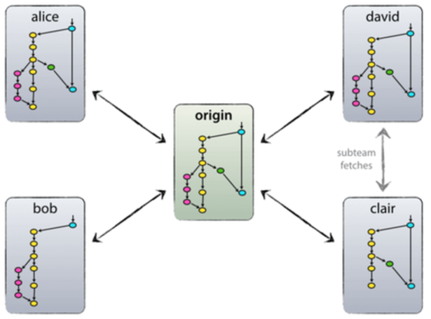

<!-- $theme: gaia -->

# Preamble
http://bit.ly/2yZWVpX

**First 10 minutes** will be spent ensuring everyone has
1. `git` installed on their computer.
2. `Github` account

Please sit in front of room if you haven't yet setup your environment

Please help your neighbors if you can

_If you didn't bring a computer, make a friend instead_

---
# Portland Data Science Group / PDXData

## Thanks to New Relic for hosting this talk!

  

---
# Intro to Git

http://bit.ly/2yZWVpX

This talk will not cover, or expect knowledge of, programming languages

1. We will introduce vocabulary
2. Understand Simplest Workflow
3. Attendants will contribute to collaborative demo

---
# Your Project!
- After I assign you a letter-line pair,
- add them to a file `README.md`
- belonging to an **existing repository**
- in **alphabetical order**.
- Finally, share your changes

```text
A is for Alice who fell down the stairs
B is for Basil assaulted by bears
C is for Clara who wasted away
...
Z is for Zillah who drank to much gin
```

---
# What is Git?
- Source and version control
- Ledger of work
- Collaboration tool
- Workflow management software

competes with : **hg**, **svn**, **cvs**

---
# What is Github?
- Git service provider
- Account management and access control
- Hosting platform
- Ticket tracker / project management tool

competes with : **GitLab**, **bitbucket**, **coding.net**

---
## What to store (Github)?
- source code (language ambiguous)
- markdown / Jupyter / pdf
- small or static images & data-sets

## What NOT to store?
- PASSWORDS, access tokens, secrets, or private keys
- compiled binaries
- large images & data-sets
- Non-pars-able documents (Word, Photoshop, ...)

---
# Passwords

```bash
$ cat secrets.json # this file should not be committed
{
    "password":"MySuperNeatoPassword!#"
}
```

```python
import json

# this file should be commited

with open('secrets.json') as fd:
    pwd = json.load(fd)['password']

print(pwd)
```

---
# Vocabulary (I)
- `remote`
**remote labels alias another location**




---
# Vocabulary (II)
- `branch`


---
# Vocabulary (III)
- `init` / `clone` - Starts Project
- `add`/`commit` and Commit History - Tracks Changes
- `fetch`/`merge` and Merge Conflicts
- `push` - Share Changes
- `diff`, `status`, `log` - What state am I in?

---
# Workflow Map


---
# Give me your Username in Exchange for A Ticket

---
# 

---
# Rules of the Game
- 10 people per repository team {Red, Blue, Black}
- No more than 80 characters per line
- This poem is expected ordered alphabetically
- Each ticket represents one letter of short story
- Your team is done when the remote repository is complete
- 15 minutes

---
# Git Commands
- `status`, `diff`
- `clone`, `init`
- `fetch`, `merge`, `commit`, `push`, `fetch`

```bash
$ git clone https://github.com/PortlandDataScienceGroup/ABC.git
Cloning into 'ABC'...
remote: Counting objects: 500, done.
remote: Compressing objects: 100% (36/36), done.
remote: Total 500 (delta 27), reused 33 (delta 12), pack-reused 451
Receiving objects: 100% (500/500), 6.72 MiB | 1.71 MiB/s, done.
Resolving deltas: 100% (286/286), done.
Checking connectivity... done.
$
```

---
# Github activities
- `fork`
- `pull request`
- Code reviews
- Create / destroy user and organization accounts
- Access control
- Create / destroy repository
- Issue creation / assignment / management
- Gists

---
# Demo
Collaboration within a team is different than from outside, as a consiquence of access control

Lets respond to a open source git issue

---
# Steps
1. Identify an issue
2. `fork` issue on Github
3. `clone` repository to local directory
4. `branch` to encapsulate our edits
5. Edit files, save and `commit` changes
6. `push` changes to branch on forked repository
7. `pull request` fork-branch on original repository
